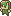

# Low-Level Graphic
###### Kat R. | CS 439: Game Engine Development

> Exercise your skills at low-level graphics programming by producing some sort of image using only graphics primitives.
> 
> We have discussed a number of low-level graphics packages, including those in Python, JavaScript, and Java. You may use these or another language with an appropriate library to build some sort of image.
###### _from the "Low-level graphic" assignment page on [Canvas](https://bsu.instructure.com/courses/175355/assignments/2300662)._

## Project Overview
This project uses the `Swing` and `AWT` libraries provided by Java.
I have supplied the program with a color palette and a "bitmap" of sorts.
The program draws this bitmap in several different forms.   
First with squares, then with circles, then rotated, then scaled.

This program uses no coordinates other than (0, 0).
Instead, it only transforms the drawing context.

## Technologies Description
The "color palette" is an array of Color objects. 
The "bitmap" is a 2D array of indexes corresponding to said palette.
The process follows a certain flow:

1. Before drawing, the canvas stores its current `AffineTransform` to a variable.
2. Within each row, the canvas draws a shape of a certain size by iterating over a row of the bitmap and using the corresponding colors.
3. After drawing one pixel, the canvas translates itself to the right by a factor of the pixel size.
4. After completing a row, the canvas resets its transformation to the variable from step 1.
5. The canvas then translates itself down the window by pixel size * rows completed.
6. The canvas draws the next row.
  
7. Before drawing the next bitmap (circles, skewed, etc.),
  the canvas translates to a new position in the window before applying a rotation and/or scaling transform if applicable.
8. This new location/position/rotation/scale **<ins>becomes the base transform</ins>**
  and is stored in the variable from step one.
9. The process repeats itself until all "versions" of the "bitmap" are drawn.

## Quick Analysis of what I Learned
As the project is not yet finished, I cannot yet provide this analysis. 
However, I _can_ provide a running list of things I have learned _so far_.

- Positioning the Swing window to open in the center of the user's desktop.
- How and when to appropriately store, mutate, and restore `AffineTransformation` to/from the canvas.
  - How to precisely translate the canvas while iterating over the "bitmap".

## Installation / Running Instructions
This repository stands as an IntelliJ project with the IntelliJ build system.
That said, many IntelliJ specific files/folders are excluded from the repository.
With the `<project name>.iml` present, cloning the project will suffice. Once cloned, simply run the file `LLGraphic.java`.

It is recommendable to clone the repository via IntelliJ's **<kbd>File</kbd> → <kbd>New</kbd> → <kbd>Project from Version Control...</kbd>** window,
supplying the link to this repository in the corresponding field <kbd>URL:</kbd>.

## Third-Party Resources
The "image"/"bitmap" supplied is adapted from a sprite frame in the image `elf.png`  from 
[the below itch.io asset pack](https://toadzillart.itch.io/dungeons-pack) 
by [Toadzilla](https://toadzillart.itch.io/).
I am currently using these assets in a project for CS 315, so it was quick and easy to access.

You may scroll down when on the asset pack page to find the **License** section.
You may click the gif below to open the webpage.

> ### License
> #### You can:
>
>   ✔️ Use the assets for non-commercial & commercial projects!  
>   ✔️ Adapt and/or modify the assets to match your project.  
>   ✔️ Credit me ("Toadzilla") with link to this pack  
>   
> #### You can **NOT**:
> 
>   ❌Distribute or sell those assets directly (even modified).  
>   ❌Claim the asset yours.  
>   ❌Use the assets in an crypto / NFT / meta related project.

