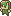
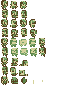

# Low-Level Graphic

###### Kat R. | CS 439: Game Engine Development

> Exercise your skills at low-level graphics programming by producing some sort of image using only graphics primitives.
>
> We have discussed a number of low-level graphics packages, including those in Python, JavaScript, and Java. You may
> use these or another language with an appropriate library to build some sort of image.

###### _from the "Low-level graphic" assignment page on [Canvas](https://bsu.instructure.com/courses/175355/assignments/2300662)._

## Project Overview

This project uses the `Swing` and `AWT` libraries provided by Java.
I have supplied the program with a color palette and a "bitmap" of sorts.

Though five different applications are present, the `FractalApp` in the `fractal` package actually follows the rubric.

## Technologies Description

### "Affine App"
The "color palette" is an array of Color objects.
The "bitmap" is a 2D array of indexes corresponding to said palette.
The process follows a certain flow:

1. Before drawing, the canvas stores its current `AffineTransform` to a variable.
2. Within each row, the canvas draws a shape of a certain size by iterating over a row of the bitmap and using the
   corresponding colors.
3. After drawing one pixel, the canvas translates itself to the right by a factor of the pixel size.
4. After completing a row, the canvas resets its transformation to the variable from step 1.
5. The canvas then translates itself down the window by pixel size * rows completed.
6. The canvas draws the next row.
     
7. Before drawing the next bitmap (circles, skewed, etc.),
   the canvas translates to a new position in the window before applying a rotation and/or scaling transform if
   applicable.
8. This new location/position/rotation/scale **<ins>becomes the base transform</ins>**
   and is stored in the variable from step one.
9. The process repeats itself until all "versions" of the "bitmap" are drawn.

### "Motion App"
This uses the spritesheet directly as a `BufferedImage` object.
In short, the "sprite" "moves" across the window, 
changing sprite frames after a specified number of paint calls (de facto, application framerate).
Once it passes beyond the right edge of the window, it wraps around to the left.

This process _also_ follows a certain flow.
1. The canvas draws a white background (to "hide" previous "sprite" frames)
2. Based upon the number of `paintCallsBeforeSwitchingFrames`,
  the `timesPaintedThisFrame` will reset and increment the sprite frame index by one
  when `timesPaintedThisFrame = timesPaintedThisFrame % paintCallsBeforeSwitchingFrames`
  sets `timesPaintedThisFrame` to 0.
3. The "sprite" "moves" by a factor of `dx`.
  This affects the canvas's translation, not the actual x-position of the "sprite".
4. After all of those calculations, 
  the canvas draws the region of the spritesheet corresponding to the current frame.
5. The process repeats itself indefinitely.

### "Player App"
1. Because the canvas's coordinate plane does not allow integers, the plane is scaled 0.05 times. This makes the canvas 20 times bigger.
2. The canvas draws a white background.
3. The canvas has a `Player`. It `tick()`s and `draw()`s the player in that order.
4. The player holds a `Sprite`. The `Player` `tick()`s the `Sprite` when canvas ticks the player.
5. The player holds a location (x, y).
6. When the player is drawn, the player passes the `draw()` call, location, and graphics context to the Sprite.
7. The Sprite, in turn, actually draws itself based on its current animation frame.
   - When the Sprite `tick()`s (ergo `onTick()`), its parent `Tickable` class calculates time in milliseconds that has passed since the last time it was ticked.
   - The Sprite has a spritesheet organized into frames. The Sprite has chosen a current frame.
   - Based on a set FPS, the Sprite increments its current frame index by `deltaTime / (1 / fps)`
     - Where `deltaTime` is the time passed since last tick plus the time leftover in the frame change of the last tick
       - That is to say, if the frame changes every 500ms and the previous tick was only 200ms,
         I need to add that 200ms to the new time since last tick.
         Otherwise, the sprite may be stuck on the same frame forever.
   - The sprite knows the coordinate position of the current frame in the spritesheet image. 
        Using this position, the size of a frame, and the location passed down by the player, it draws itself to the canvas.
8. Pressing/releasing WASD at any time changes the player's "velocity," which updates their location each `tick()`.

### "Input App"
1. The `InputCanvas` has a background color initially set as white.
2. Keybinds for each key in the word <kbd>R</kbd><kbd>A</kbd><kbd>I</kbd><kbd>N</kbd><kbd>B</kbd><kbd>O</kbd><kbd>W</kbd> are added to the canvas via the KeyListener interface.
3. Actions for each input are in a switch case according to the key pressed
   - Each key changes the background color to a new color.
4. When a bound key is pressed, the screen color changes.

### "Fractal App"
1. A triangle polygon is constructed.
2. A scale and rotation are initialized.
3. Each draw...
   1. Center the triangle on the screen
   2. Scale it and multiply scale by scale factor
   3. Rotate it and increment rotation factor
4. And repeat

## Quick Analysis of what I Learned

### Affine App
- Positioning the Swing window to open in the center of the user's desktop.
- How and when to appropriately store, mutate, and restore `AffineTransform` to/from the canvas.
- How to precisely translate the canvas while iterating over the "bitmap".
- How and when to rotate the canvas (in radians), and how said rotation affects translations done before and after.

### Motion App
- How to buffer an image into the canvas, with error handling.
- How to use frames from a spritesheet image to create framerate-dependent animations
- How to detect the edges of the window

### Input App
- How to implement keybindings using:
  1. InputMaps, ActionMaps, and Actions
  2. KeyListener/KeyAdapter
  3. KeyEventDispatcher
- From my tinkering, I've found that KeyListener/KeyAdapter is the most powerful (detects typing, presses, and releases).  
  The catch is that the listener needs to be added to your `JFrame`. If you can't do this...
- ...use a `KeyEventDispatcher`. This can only detect typing, 
  but it "pre-listens" so that you don't have to hook it up to the parent `JFrame`.

### Fractal App
- How to increment `AffineTransform` variables and change color
- How to wait a certain number of frames between draws

### _<ins>Player App</ins>_

- How to move the player using these keybindings.
  - How to debounce key presses to keep them from applying repeatedly. This allows for smooth motion.  
  <i>A massive hitch, however, is that the coordinate plane in a component **only accepts integers**.
  I work around this by changing the graphics context to a much smaller scale.</i>

- How to implement a framerate-independent update system. (See `Tickable` abstract class)
    - How to calculate the current frame based upon time passed, factoring in extra ticks between frames.

- How to rig a basic animation state machine using frame ranges
  - How to separate different animations into ranges of frame indices
  - How to use the dimensions of a spritesheet and the size of each frame to calculate the coordinate position of a frame in the spritesheet image.

## Installation / Running Instructions

This repository stands as an IntelliJ project with the IntelliJ build system.
That said, many IntelliJ specific files/folders are excluded from the repository.
With the `<project name>.iml` present, cloning the project will suffice. Once cloned, simply run the file
`affine.AffineApp`, `motion.MotionApp` `input.InputApp.java`, `player.PlayerApp`, **_or more importantly, `fractal.FractalApp`_**.

It is recommendable to clone the repository via IntelliJ's **<kbd>File</kbd> → <kbd>New</kbd> → <kbd>Project from
Version Control...</kbd>** window,
supplying the link to this repository in the corresponding field <kbd>URL:</kbd>.

## Third-Party Resources

The "image"/"bitmap" supplied to the **Affine App** is adapted from a sprite frame in the image
`elf.png`  from
[the below itch.io asset pack](https://toadzillart.itch.io/dungeons-pack)
by [Toadzilla](https://toadzillart.itch.io/).

The spritesheet used for the **Motion App**, 
which is the origin of previously mentioned frame.

I am currently using these assets in a project for CS 315, so it was quick and easy to access.

You may scroll down when on the asset pack page to find the **License** section.
You may click the gif below to open the webpage.
Alternatively, you can view the license word-for-word by opening the details pane below.

    
License

    <blockquote>
        <h3>License</h3>
        <h4>You can:</h4>
        

            ✔️ Use the assets for non-commercial & commercial projects!
             
            ✔️ Adapt and/or modify the assets to match your project.
             
            ✔️ Credit me ("Toadzilla") with link to this pack
        

        <h4>You can <b>NOT</b>:</h4>
        

            ❌ Distribute or sell those assets directly (even modified).
             
            ❌ Claim the asset yours.
             
            ❌ Use the assets in an crypto / NFT / meta related project.
        

    </blockquote>

